  <picture>
    <source media="(prefers-color-scheme: dark)" srcset="assets/dark.svg">
    <source media="(prefers-color-scheme: light)" srcset="assets/light.svg">
    
  </picture>

 

 

---

### 💡 Core Philosophy

> *"Building reliable applications through Quality Engineering, Automation and Modern Frontend Development."*

Sri Aditya Durga Ram is a **Software Engineer** specializing in end-to-end Quality Automation, Playwright & Selenium test frameworks, modern React.js frontend development, REST API verification, and AI-assisted software development workflows.

---

### 🛠️ Technical Stack Overview

| Category | Skills & Tools |
| :--- | :--- |
| **QA Automation** | `Playwright` `Selenium WebDriver` `TestNG` `Cucumber BDD` `API Testing` `Qase` `Bugasura` |
| **Testing Types** | `Manual Testing` `Functional Testing` `Regression Testing` `Smoke Testing` |
| **Frontend Dev** | `React.js` `JavaScript` `TypeScript` `HTML5` `CSS3` `Tailwind CSS` `Material UI` `Bootstrap` |
| **Core Dev & Tools** | `Java` `Postman` `REST APIs` `Git` `GitHub` `Jira` `Maven` `MySQL` |
| **AI Engineering** | `AI Agents` `Prompt Engineering` `AI-Assisted Development` |

---

### 📌 Selected Work & Engineering Highlights

#### 01. AI Test Case Generator
* **Description:** AI-powered system that generates structured software test cases and integrates them with Qase. Designed to evolve toward generating Playwright automation tests and tracking execution results.
* **Tech Stack:** `Node.js` • `AI` • `Qase API` • `Playwright` • `TypeScript`

#### 02. Automation Testing Framework
* **Description:** Enterprise test automation framework for web applications utilizing modern test automation practices, page object patterns, and BDD test suites.
* **Tech Stack:** `Selenium` • `Java` • `TestNG` • `Cucumber` • `REST APIs`

#### 03. Network Configuration Auditing Platform
* **Description:** Developed responsive frontend modules and analytics dashboards for network configuration auditing workflows, including filtered audit reports, API integration, and real-time visualization.
* **Tech Stack:** `React.js` • `Material UI` • `REST APIs`

#### 04. Hospital Management System
* **Description:** Built user interfaces and integrated REST APIs for healthcare administration workflows, patient records, and service tracking.
* **Tech Stack:** `React.js` • `Tailwind CSS` • `REST APIs`

#### 05. Personal Portfolio Website
* **Description:** Ultra-responsive web application showcasing engineering projects, technical skills, interactive demos, and professional experience.
* **Tech Stack:** `React.js` • `JavaScript` • `HTML5` • `CSS3`

---

  Designed &amp; Maintained by <b>Sri Aditya Durga Ram</b> (@sriaditya445) • 2026

